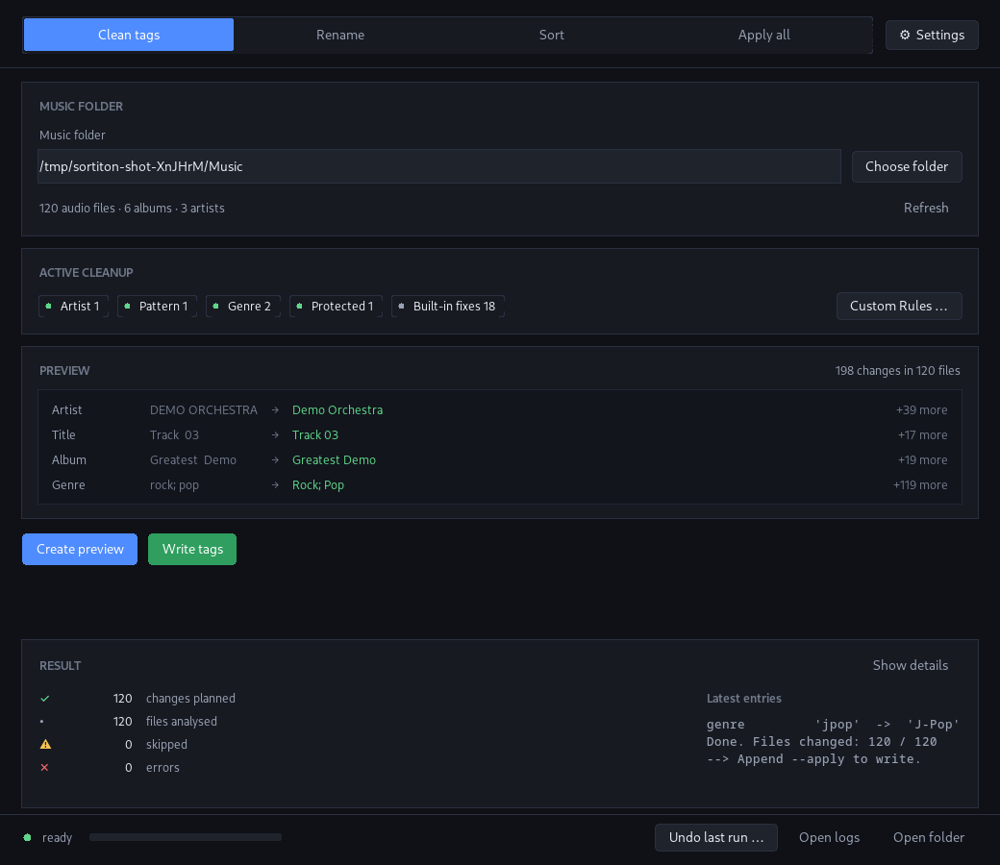

# Sortiton


A music sorter for Linux. It cleans up tags, renames files from those tags and
sorts them into a library - the Linux port of some old PowerShell scripts.



## Features

- **Clean tags**, **Rename**, **Sort**, **Apply all** - nothing is written
  before you have seen a preview of it.
- **Your own rules, no code:** artist and genre fixes go into `my_rules.ini`.
- A name that is already taken gets `(2)`, `(3)`, …; a file that sits in the
  target with identical content is skipped. Nothing is overwritten.
- Every run lands in a journal, and `sortiton restore --apply` turns it back.
- The rules are idempotent: running them twice gives the same result as once.
  Genres are not split at `-` either, so `J-Pop` stays intact.
- Few dependencies: Tkinter, ffmpeg for tags, mutagen if you want it faster.

## Install

Nothing has to be installed to run the release files, ffmpeg aside:

- **`Sortiton-<version>-x86_64.AppImage`** - one file: `chmod +x` it and start
  it (a double click works as well; it needs `libfuse2`).
- **`sortiton-<version>-linux-x86_64.tar.gz`** - unpack it and run
  `Sortiton/Sortiton`; the same folder holds `sortiton`, the command line.

Both come from [Releases](https://github.com/Chuu2byou/Sortiton/releases);
`SHA256SUMS` lists their checksums. Tkinter and mutagen are bundled, ffmpeg is
not. Logs, backups, `settings.ini` and `my_rules.ini` live in
`~/.local/share/sortiton/`; `SORTITON_DATA_DIR` moves the folder.

From the source (Python 3.12 or newer):

```bash
sudo apt install ffmpeg python3-tk        # Debian/Ubuntu
sudo pacman -S ffmpeg tk                  # Arch/Manjaro
sudo dnf install ffmpeg python3-tkinter   # Fedora

sudo apt install python3-mutagen          # optional: faster tag writing
sudo apt install kdialog                  # optional: native KDE dialogs

pipx install "git+https://github.com/Chuu2byou/Sortiton.git"
pipx inject sortiton mutagen              # optional: faster tag writing
```

This brings the commands `sortiton` (the command line) and `sortiton-gui` (the
window); `python -m sortiton.gui` does the same. In a virtual environment
`pip install ".[mutagen]"` takes the optional mutagen along.

## The window

```bash
sortiton-gui
```

Four tabs - **Clean tags**, **Rename**, **Sort**, **Apply all** - all in the
same order: create a preview, check it, then write. The button that writes
stays disabled until a preview for exactly these inputs has run, and locks
again as soon as an input changes. "Apply all" does everything in one run:
clean tags → rename → sort into the library.

The status bar shows the running step and the progress; the result area shows
the counters of the last run next to the newest log lines ("Show details"
opens the full log). Folder pickers open a native system dialog (`kdialog` on
KDE, `zenity` on GNOME), Tkinter only as a fallback. Before anything is
written, the confirmation shows the counts and offers a backup of the original
files (see [Logs, backup and undo](#logs-backup-and-undo)). "Undo last run …"
lists the journals and shows the plan before anything happens.

## The command line

> **Important:** without `--apply` every command only runs a **preview** -
> nothing is changed.

```bash
sortiton tags   ~/Downloads/Music              # clean tags
sortiton rename ~/Downloads/Music --apply      # %artist% - %title%
sortiton sort   ~/Downloads/Music ~/Music --move --apply
sortiton all    ~/Downloads/Music ~/Music --move --apply
sortiton scan   ~/Music                        # count files/albums/artists
sortiton rules  --template                     # create my_rules.ini
sortiton restore --list                        # which runs can be undone
sortiton restore --apply                       # undo the last run
```

In the source tree the same commands run as `python3 sortiton.py …`.

Placeholders: `%artist%`, `%albumartist%`, `%album%`, `%title%` (default
`%artist% - %title%`).

## Your own rules (`my_rules.ini`)

Artist names and anything that only your collection needs belong in
`my_rules.ini` instead of the code; the file is read on every run.

```ini
[Artist]                   # own spellings (case does not matter)
Sample Band = Sample Band Official

[Artist Regex]             # patterns (regular expressions, groups like \1 work)
(?i)\bsample\s+band\b = Sample Band

[Genre]                    # unify spellings; nothing right of "=" deletes the genre
synthpop = Synth-Pop
junkgenre =

[Protected]                # stays exactly as it is and is never split
Example & Co
Foo/Bar = Foo / Bar
```

- **Create:** `sortiton rules --template` - or "Custom Rules …" in the GUI.
- **Check:** `sortiton rules` shows the path, the loaded rules and any
  warnings; a broken line is skipped, it does not abort the run.
- **Built-in rules:** `sortiton rules --builtin` lists them (genre aliases such
  as `jpop = J-Pop`, structural fixes such as `"  +" = " "`); they are always
  active and applied **before** your own rules.
- Names containing "&", "/" or "," are never split; an **empty value**
  (`junkgenre =`) deletes the genre. Another location: `SORTITON_RULES`.

## Logs, backup and undo

Every run - in the GUI and on the command line - writes a log file into `logs/`
(`sortiton_<date>_<time>.log`, the last 50 are kept) and a machine-readable
**journal** next to it. The GUI shows the newest lines in the result area,
"Show details" opens the full log, "Open logs" the folder.

Before tags are written, every file that is about to change can be copied into
`backups/` (relative paths kept, so restoring is a plain copy back). The option
is on by default, switchable in the confirmation dialog and remembered in
`settings.ini` (`--backup` on the command line, the last 10 runs are kept).

`sortiton restore` reads the journal and turns the changes around, newest
first, so a combined run (tags -> rename -> sort) comes back as sort -> rename
-> tags:

```bash
sortiton restore --list            # which runs can be undone
sortiton restore                   # preview: what the undo would do
sortiton restore --apply           # undo it
```

A step whose old name is taken again is **skipped**, never overwritten. A run
that copied files is undone by deleting those copies - the original stays. The
preview rule holds here too: without `--apply` nothing is changed. `restore`
writes a journal of its own, so an undo stays traceable;
`SORTITON_JOURNAL=false` switches the journal off.

Tags are read with **mutagen** if installed (~1.8 ms/file) and written in
place; ffprobe/ffmpeg is the fallback. Reading, writing and copying run in
parallel.

## Environment variables

Every path and a few switches can be overridden without touching a file:

| Variable | Meaning |
| --- | --- |
| `SORTITON_DATA_DIR` | folder of the released app (`~/.local/share/sortiton`) |
| `SORTITON_RULES` | path of `my_rules.ini` |
| `SORTITON_LOG_DIR` | folder for the log files |
| `SORTITON_BACKUP_DIR` | folder for the backups |
| `SORTITON_SETTINGS` | path of `settings.ini` |
| `SORTITON_BACKUP` | `false` disables the backup |
| `SORTITON_JOURNAL` | `false` disables the run journal (`restore` then has nothing) |
| `SORTITON_FOLDER` / `SORTITON_TARGET` | start folders of the GUI |

## Contributing

Bug reports and pull requests go through the issue tracker. Before sending a
patch, run both of these:

```bash
tools/checks.sh               # syntax, imports, smoke test, pylint, CLI
tools/build_app.sh            # freeze the program (tar.gz, --appimage)
```

How the project is laid out, what the checks do and how a release is cut is
described in [CONTRIBUTING.md](CONTRIBUTING.md).

## License

MIT, see [LICENSE](LICENSE).
